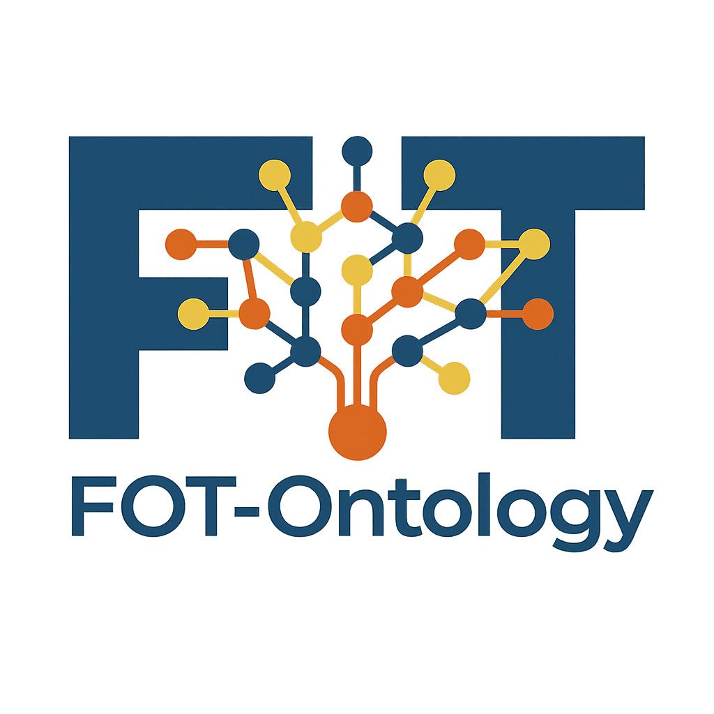

<div align="center">
  
  <br> <hr>
  # FOT-Ontology: Patent Field of Technology Ontology Construction
  <br> <hr>
</div>

[](https://www.python.org/downloads/)
[](https://www.google.com/search?q=LICENSE)
[](https://www.google.com/search?q=https://huggingface.co/datasets/tim-berg/fot-storage-dataset)

**FOT-Ontology** is a comprehensive, end-to-end pipeline for constructing a large-scale, multi-layered **Field of Technology (FOT)** ontology. By combining static knowledge bases with dynamic entity extraction from massive patent datasets, this project addresses the limitations of traditional classification systems in capturing emerging and interdisciplinary technologies.

## 🚀 Key Features

  * **Dual-Layer Architecture**:
      * **Static Layer**: Establishes a stable core (Levels 1-3) using the IPC classification system and Wikipedia, refined via **BLINK** entity linking and **GAT** (Graph Attention Networks).
      * **Dynamic Layer**: Automatically discovers emerging concepts (Levels 4-6) from over 88 million patent titles using deep learning.
  * **PatentNER Model**:
      * A specialized **SciBERT + BiLSTM + CustomCRF** architecture designed for patent text.
      * Achieves **96.10% F1-score** on FOT extraction by incorporating 7 patent-specific constraint rules and POS-weighted loss functions.
  * **Scalable Hierarchy Construction**:
      * Integrates density-based clustering (**DBSCAN**) with hierarchical clustering (**Ward's method**) to organize hundreds of thousands of dynamic concepts into a deep semantic hierarchy.
  * **Production-Ready Data Pipeline**:
      * Fully integrated with **Google BigQuery** and **Google Cloud Storage (GCS)** for handling terabyte-scale patent data.

-----

## 🛠️ Installation

### 1\. Clone the repository

```bash
git clone https://github.com/Aviciiiiii/FOT-Ontology.git
cd fot-ontology
```

### 2\. Install dependencies

This project requires Python 3.10+. We recommend using a virtual environment.

```bash
# Install Python requirements
pip install -r requirements.txt

# Install SpaCy models (required for POS tagging)
python -m spacy download en_core_web_sm
python -m spacy download en_core_web_md
python -m spacy download en_core_web_lg
```

### 3\. API Configuration (Optional)

If you intend to run the **Stage 3 (Patents & FOT)** pipeline in "Real Mode" (fetching fresh data from Google Cloud), set your credentials via environment variables:

```bash
export GOOGLE_APPLICATION_CREDENTIALS="/path/to/your/service-account-key.json"
export GOOGLE_API_KEY="your_api_key"  # For Google Custom Search in Stage 2
```

*Note: For reproducing results using the provided datasets, these keys are **not** required.*

-----

## 📥 Data Setup

Patent data and model checkpoints are too large for the Git repository. We host processed datasets and pre-trained models on **Hugging Face** to ensure reproducibility.

**You must run the download script before executing the pipeline.**

```bash
# 1. Make the script executable
chmod +x download_data.sh

# 2. Download models and datasets
./download_data.sh
```

**This script will automatically:**

  * Download base models (**SciBERT**, **DistilBERT**) to `files/`.
  * Download **BLINK** entity linking models to `src/BLINK-main/models/`.
  * Download processed datasets for Stages 1-3 to `data/`.
  * Download all pre-trained checkpoints from the ablation studies to `reports/models/`.

-----

## 🏃‍♂️ Running the Pipeline

The project uses a unified CLI entry point (`fot.cli`). You can run stages sequentially.

### Stage 1: Build Static Ontology

Constructs the foundational layers (L1-L3) using IPC seeds and Wikipedia.

```bash
# Quick test (Dry-run)
python -m fot.cli build-static-ontology --config-dir configs --dry-run --fast

# Full run (requires downloaded data)
python -m fot.cli build-static-ontology --config-dir configs --fast
```

### Stage 2: Dynamic Ontology & NER Training

Constructs the FOT training dataset and trains the PatentNER model.

```bash
# Run pre-training and fine-tuning
python -m fot.cli build-dynamic-ontology --config-dir configs --fast
```

*Note: The download script already provides the best checkpoint (`NER_finetune_model_best.pth`) in `artifacts/models`, so you can skip this step if you only want to run inference.*

### Stage 3: Extraction & Hierarchy

Extracts FOT concepts from patent titles and builds the dynamic hierarchy (L4-L6).

```bash
# 1. Extract FOT entities from patents (Supports GPU acceleration)
python -m fot.cli extract-fot --config-dir configs --fast

# 2. Build the dynamic hierarchy (Clustering)
python -m fot.cli build-hierarchy --config-dir configs
```

-----

## 🧪 Reproduction: Model Comparison

To reproduce the comprehensive ablation studies and performance comparison reported in the project:

```bash
# Run full model comparison suite
python -m fot.cli ner-comparison --config-dir configs
```

### Expected Results

The command above evaluates our **PatentNER** model against several baselines (BiLSTM-CRF, BERT-CRF, SciBERT-CRF) and ablation settings. The expected output matches the table below:

| Model | Precision (%) | Recall (%) | F1-score (%) | Inference Speed (samples/s) |
| :--- | :---: | :---: | :---: | :---: |
| BiLSTM-CRF | 35.46 | 15.81 | 21.87 | 889.04 |
| BERT-CRF | 76.96 | 50.91 | 61.28 | 578.06 |
| SCIBERT-CRF | 71.33 | 71.09 | 71.21 | 863.36 |
| **PatentNER** | **81.01** | 67.27 | **73.50** | 246.88 |
| PatentNERnopos | 78.23 | 67.75 | 72.61 | 247.90 |
| PatentNERNoCRFRules | 72.97 | 63.33 | 67.81 | 784.00 |
| PatentNERnofocalloss | 75.12 | 70.72 | 72.85 | 247.14 |
| PatentNERnol2 | 78.85 | 68.77 | 73.46 | 247.86 |
| **PatentNERpretrained** | **96.11** | **94.57** | **95.34** | 234.69 |

*Note: Pre-trained checkpoints for all these models are included in the data download (`reports/models/`), allowing for immediate evaluation without retraining.*

-----

## 📄 License

This project is licensed under the **MIT License**. See the [LICENSE](https://www.google.com/search?q=LICENSE) file for details.

## 🤝 Acknowledgements

  * [BLINK](https://github.com/facebookresearch/BLINK) for the entity linking architecture.
  * [SciBERT](https://github.com/allenai/scibert) for the pre-trained scientific language model.
  * [DistilBERT](https://arxiv.org/abs/1910.01108) for the lightweight and efficient transformer model.
  * [Hugging Face](https://huggingface.co/) for hosting the datasets and models.
